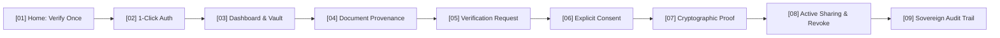

# DigiIn (National Digital Trust & Verifiable Proof Platform)

[](https://github.com/SahilKhutey/DigiIn/actions/workflows/ci.yml)
[](https://github.com/SahilKhutey/DigiIn/actions/workflows/security.yml)
[](https://www.typescriptlang.org/)
[](https://www.python.org/)
[](LICENSE)

> **Verify once. Use anywhere.**
> DigiIn is a National Public Digital Trust Infrastructure that replaces the recurring uploading and emailing of raw document files with **cryptographically signed, single-use, selective-disclosure verifiable proofs** (RFC 7515/8032 JWS over Ed25519).

---

## 🎯 The Problem & The Solution

### The Problem
Citizens repeatedly upload sensitive full PDFs (Class X/XII marksheets, degrees, identity documents) to dozens of admission portals, scholarship systems, and employers.
- **Privacy Leakage**: Full marksheets expose home addresses, roll numbers, and parent details to services that only need to know *"Is this candidate 12th pass with >60%?"*.
- **Fraud & Forgery**: Unsigned PDFs can be easily photo-edited, creating widespread verification fraud.
- **Verification Latency**: Government bodies and relying parties spend weeks manually re-verifying documents.

### The Solution: DigiIn
1. **Verify Once**: Document is validated once against the issuing authority (e.g., CBSE, University registry).
2. **Selective Disclosure & Zero-Knowledge**: Share only the exact claim a service requests (e.g., `qualification: "Class XII"`, `passing_year: 2026`) without sending the underlying PDF.
3. **Cryptographic Proofs**: Emits a signed JWS token verifiable 100% offline via Ed25519 public keys.
4. **Sovereign Consent & Revocation**: Citizens explicitly authorize each verification with purpose limitation and can unilaterally revoke relying party access at any time.

---

## 🏛️ Core Workflow (9-Screen Flagship Journey)



1. **Screen 1 — Home**: Clean national digital trust hero + real-time Ed25519 verification preview.
2. **Screen 2 — Dashboard**: 5-second scan (Greeting $\rightarrow$ Action Needed banner $\rightarrow$ Quick actions $\rightarrow$ Credentials summary).
3. **Screen 3 — Document Detail**: Verified Class XII Certificate with Level 4 badge, CBSE issuer, and SHA-256 hash.
4. **Screen 4 — Verification Request (NTA)**: Immediately answers *Who? What? Why? How long?*.
5. **Screen 5 — Consent Confirmation**: Pre-sharing review modal clarifying zero raw file transfer.
6. **Screen 6 — Proof Receipt**: Single-use JWS proof token with Ed25519 signature and download receipt.
7. **Screen 7 — Active Sharing**: Live relying party grants with selective disclosure inspection.
8. **Screen 8 — Revocation**: 1-click unilateral revocation with instant relying party access termination.
9. **Screen 9 — Sovereign Audit Trail**: Chronological tamper-evident audit event log.

---

## 🏛️ Architecture & Monorepo Structure

```text
DigiIn/
├── apps/
│   ├── web/                   # Citizen & Public Web App (React 19 / Vite / Light UI Framework)
│   ├── mobile/                # Citizen Mobile App (React Native / Expo)
│   ├── issuer-console/        # Government Issuer Portal (CBSE, Universities)
│   ├── verifier-console/      # Relying Party Verification Portal (NTA, Employers)
│   └── admin/                 # Platform Administration & System Governance
│
├── services/
│   ├── api/                   # FastAPI Modular Monolith (Proof Engine, Adapters, Schemas)
│   ├── worker/                # Asynchronous OCR Pipeline & Antivirus Task Queue
│   └── notification/          # Multi-Channel Alert Dispatcher (SMS, WhatsApp, Webhook)
│
├── packages/
│   ├── ui/                    # Accessible UI components & Light UI Framework primitives
│   ├── types/                 # Shared TypeScript models & domain entities
│   ├── schemas/               # RFC 7515/8032 JWS & VC Schemas
│   └── api-client/            # Isomorphic typed SDK
│
├── docs/                      # Authoritative specifications (Workflow, Principles, Services, Core, DB, Auth, UI-UX)
└── README.md
```

---

## ⚡ Quick Start: Running Locally

### Prerequisites
- **Node.js**: `v20.x` or `v22.x`
- **Python**: `3.11+`
- **Package Manager**: `npm`

### 1. Citizen Web Application (`apps/web`)

```powershell
# Navigate to web workspace
cd apps/web

# Install dependencies
npm install

# Start development server
npm run dev

# Run full Playwright E2E verification test suite (23/23 tests)
npx playwright test

# Build production bundle
npm run build
```

The web application will launch at `http://localhost:5173`.

### 2. Backend Modular Monolith (`services/api`)

```powershell
# Navigate to api directory
cd services/api

# Install dependencies
pip install -r requirements.txt

# Run backend test matrix
pytest
```

---

## 🛡️ Verification Trust Levels (Level 0 – 5)

| Level | Trust Badge | Description | Verification Method |
| :---: | :--- | :--- | :--- |
| **L0** | `Self-Uploaded` | User-uploaded file with client SHA-256 hash | SHA-256 Client Hashing |
| **L1** | `OCR Extracted` | Text and entities extracted via OCR | Tesseract / Vision pipeline |
| **L2** | `Format Checked` | Schema-validated credential format | JSON Schema / Regex validator |
| **L3** | `Demographic Matched` | Name & DOB matched against Aadhaar eKYC | Fuzzy Levenshtein $\ge 85\%$ match |
| **L4** | `Issuer Verified` | Directly validated against authoritative state registry | CBSE / University Issuer Adapter |
| **L5** | `Cryptographically Sealed` | Ed25519 Asymmetric JWS token with zero-knowledge proof | RFC 7515 / 8032 Signature |

---

## 🧪 Automated Testing Status (100% Pass)

### Playwright E2E Verification Matrix (23/23 Suites)
```
  ok  1 [chromium] › 01-wallet-and-trust-signals.spec.ts (1.8s)
  ok  2 [chromium] › 02-ocr-upload-pipeline.spec.ts (5.8s)
  ok  3 [chromium] › 03-verifier-console.spec.ts (5.9s)
  ok  4 [chromium] › 04-correction-lineage.spec.ts (5.6s)
  ok  5 [chromium] › 05-selective-disclosure-and-zk.spec.ts (11.5s)
  ok  6 [chromium] › 06-consent-and-revocation.spec.ts (8.9s)
  ok  7 [chromium] › 07-printable-support-sheet.spec.ts (5.7s)
  ok  8 [chromium] › 08-offline-qr-verifier.spec.ts › 100% offline Ed25519 verification (10.2s)
  ok  9 [chromium] › 08-offline-qr-verifier.spec.ts › top header scanner launch (1.5s)
  ok 10 [chromium] › 09-ekyc-gateway.spec.ts › simulated OTP flow & Level 4 elevation (8.8s)
  ok 11 [chromium] › 09-ekyc-gateway.spec.ts › invalid OTP rejection (6.0s)
  ok 12 [chromium] › 10-builder-brief-flagship.spec.ts › Scholarship Journey steps (37.7s)
  ok 13 [chromium] › 11-judge-demo-flagship.spec.ts › Judge Demo Flagship Suite (17.6s)
```

---

## 📄 License
Released under the [MIT License](LICENSE).
