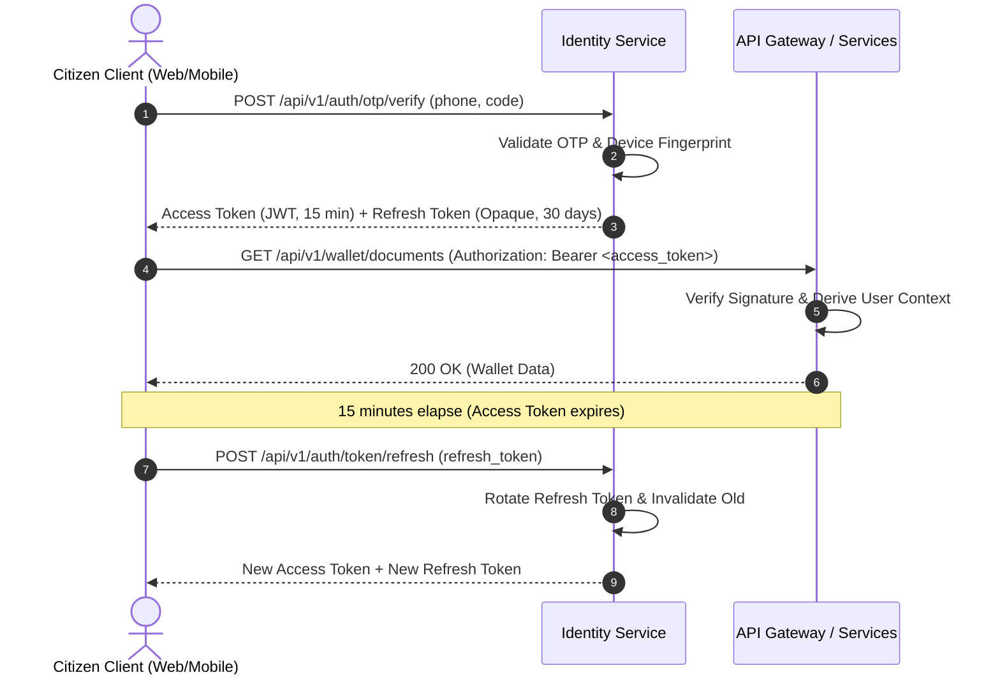
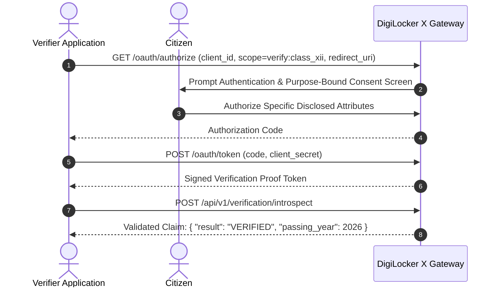

# DigiLocker X — Authentication & Authorization Specification

This specification strictly separates **Authentication** (verifying who you are), **Authorization** (what roles/permissions you have), and **Consent** (what specific data you permit a third party to inspect).

---

## 1. Authentication Mechanisms

The platform supports a layered authentication model suited for Indian public digital infrastructure:

| Auth Method | Security Tier | Primary Use Case |
|---|---|---|
| **Mobile OTP** | Standard | Default citizen login with phone number verification |
| **Passkeys (WebAuthn / FIDO2)** | High | Passwordless biometric sign-in on supported hardware |
| **Aadhaar eKYC / OTP** | Sovereign | High-assurance government identity binding & Level 4 linking |
| **Organization Client Credentials (mTLS / API Keys)** | Enterprise | Authorized Issuers and Verifiers |

---

## 2. Token & Session Architecture



### Access Token Specification (JWT)
- **Lifetime**: 10–15 minutes.
- **Algorithm**: `ES256` or `EdDSA` (asymmetric signature).
- **Payload Claims**:
  ```json
  {
    "iss": "https://api.digilocker-x.gov.in",
    "sub": "usr_9b3e120f-48d1-4cb3-91ec-4581f1816bc8",
    "role": "CITIZEN",
    "scopes": ["document:read", "credential:read", "verification:consent"],
    "iat": 1787392800,
    "exp": 1787393700,
    "jti": "jwt_7f8a912e34"
  }
  ```

### Refresh Token Security
- Stored as a hashed token in Redis with a 30-day sliding TTL.
- **Automatic Token Rotation (RTR)**: Each refresh generates a new token pair and invalidates the previous refresh token immediately.
- If an invalidated refresh token is reused, all tokens issued in that session family are immediately revoked (breach detection).

---

## 3. Role-Based Access Control (RBAC) & Permissions

### Roles
1. `CITIZEN`: Sovereign account holder managing their personal wallet, credentials, and consents.
2. `ISSUER`: Government body or authorized board issuing credentials and handling verification queries.
3. `OFFICER`: Government reviewer inspecting discrepancy queues, evidence, and manual approvals.
4. `REQUESTER`: External entity submitting verification inquiries.
5. `ADMIN`: Platform administrator managing system policies, registries, and security.

### Permissions Matrix
| Permission | Description | CITIZEN | ISSUER | OFFICER | REQUESTER | ADMIN |
|---|---|:---:|:---:|:---:|:---:|:---:|
| `document.read` | View personal document metadata | ✓ | - | ✓ (in case) | - | ✓ |
| `document.upload` | Upload self-attested files | ✓ | - | - | - | - |
| `credential.issue` | Issue new verifiable credentials | - | ✓ | - | - | ✓ |
| `credential.read` | Inspect user credentials | ✓ | ✓ (owned) | ✓ (in case) | ✓ (if consented) | ✓ |
| `verification.request` | Create inbound verification query | - | - | - | ✓ | ✓ |
| `verification.consent` | Grant or revoke verification consent | ✓ | - | - | - | - |
| `officer.review` | Adjudicate discrepancy cases | - | - | ✓ | - | ✓ |
| `admin.manage` | Configure system registries & keys | - | - | - | - | ✓ |

---

## 4. OAuth 2.0 / OIDC Verification Delegation Flow

External applications **never** receive direct citizen login credentials or full document downloads. They obtain verifiable proofs via OIDC consent delegation:



---

## 5. Security Guardrails

1. **Derived Identity Rule**: All backend endpoints derive the active user ID strictly from the authenticated JWT session context. The API **never** accepts `user_id` from client query params or request bodies.
2. **OTP Rate Limiting & Throttling**:
   - Maximum 3 OTP requests per phone number per 15 minutes.
   - Maximum 5 failed verification attempts before account temporary lockout.
   - OTP codes are single-use with a 3-minute strict TTL.
3. **Audit Ledger**: All authentication milestones (`LOGIN_SUCCESS`, `LOGIN_FAILED`, `TOKEN_ROTATED`, `CONSENT_REVOKED`) are immediately dispatched to the immutable domain events audit store.
