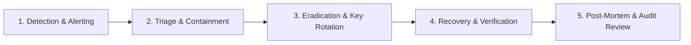

# DigiIn Security Incident Response & Breach Protocol

## 1. Incident Severity Levels

- **SEV-1 (Critical)**: Active cryptographic key compromise, unauthorized data exfiltration, or total verification engine outage.
- **SEV-2 (High)**: Bypass of tenant isolation, unhandled IDOR vulnerability, or elevated account takeover attempts.
- **SEV-3 (Medium)**: Transient provider adapter failure, unexpected rate limiting errors, or non-exploitable configuration defects.
- **SEV-4 (Low)**: Minor log anomalies, UI cosmetic errors, or non-security deprecation warnings.

---

## 2. Five-Phase Response Workflow

1. **Detection**: Automated security alerts trigger on 100+ failed logins/min, circuit breaker trips, or signature mismatches.
2. **Containment**: Immediate token revocation (`revoke_all_user_sessions`), IP-level rate limit blacklisting, and temporary provider adapter suspension.
3. **Eradication**: Automated key rotation (`KEY-2026-01` $\rightarrow$ `KEY-2026-02`), patch deployment, and database transaction rollback.
4. **Recovery**: Integrity verification using SHA-256 binary checksums and immutable audit trail validation.
5. **Post-Mortem**: Document root cause, update STRIDE threat model, and issue statutory notices as required under data protection regulations.
