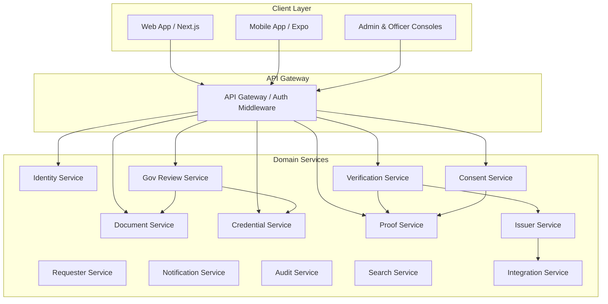

# DigiLocker X — Services Specification

This document details the responsibilities, domain boundaries, inputs, outputs, and lifecycle rules for the 13 core platform services.

---

## 1. Identity Service
**Domain**: Citizen identity, credentials, sessions, and multi-factor authentication.
- **Responsibilities**:
  - Manage user registration, account state (`ACTIVE`, `SUSPENDED`, `RECOVERY_PENDING`).
  - Coordinate passwordless authentication (Mobile OTP, WebAuthn Passkeys, Device Biometrics).
  - Issue short-lived JWT access tokens (10–15 min) and handle rotating refresh tokens.
  - Integrate with sovereign eKYC gateways (UIDAI Aadhaar OTP) for demographic binding.
- **Key Methods**:
  - `send_otp(phone_number: str) -> OtpChallenge`
  - `verify_otp(challenge_id: str, otp_code: str) -> AuthTokenPair`
  - `refresh_token(refresh_token: str) -> AuthTokenPair`
  - `match_demographics(user_id: UUID, ekyc_data: Demographics) -> MatchScore`

---

## 2. Document Service
**Domain**: Physical/digital document files, binary storage, and version lineage.
- **Responsibilities**:
  - Manage document metadata, MIME types, file hashes (SHA-256), and S3 object keys.
  - Coordinate asynchronous OCR scanning and virus inspection via background workers.
  - Track document version chains and append corrections with parent-child lineages.
- **Key Methods**:
  - `upload_document(user_id: UUID, file: BinaryIO, category: str) -> DocumentRecord`
  - `get_document_versions(document_id: UUID) -> List[DocumentVersionRecord]`
  - `supersede_version(document_id: UUID, new_metadata: dict, reason: str) -> DocumentVersionRecord`

---

## 3. Credential Service
**Domain**: Verifiable credentials, authoritative schemas, and lifecycle states.
- **Responsibilities**:
  - Store structured credential definitions (e.g., `CLASS_XII`, `DRIVING_LICENSE`, `INCOME_CERTIFICATE`).
  - Maintain credential verification levels (Level 0: Unverified, Level 1: OCR Parsed, Level 3: Officer Reviewed, Level 4: Issuer Direct).
  - Associate credentials with verified user identities and authoritative issuer IDs.
- **Key Methods**:
  - `get_user_credentials(user_id: UUID) -> List[CredentialRecord]`
  - `issue_credential(issuer_id: UUID, user_id: UUID, payload: dict) -> CredentialRecord`
  - `revoke_credential(credential_id: UUID, reason: str) -> None`

---

## 4. Verification Service
**Domain**: Verification orchestrator, rule evaluation, and policy resolution.
- **Responsibilities**:
  - Ingest verification requests from external requesters or internal workflows.
  - Query corresponding Issuer Adapters via the Issuer Registry.
  - Evaluate automated matching algorithms (Demographics + Document Number + Date Range).
  - Return standardized status codes: `VERIFIED`, `REJECTED`, `REQUIRES_REVIEW`, `ISSUER_UNAVAILABLE`, `NOT_FOUND`.
- **Key Methods**:
  - `create_request(requester_id: UUID, user_id: UUID, purpose: str, attributes: List[str]) -> VerificationRequest`
  - `evaluate_verification(request_id: UUID) -> VerificationResult`

---

## 5. Consent Service
**Domain**: Explicit citizen authorization, scopes, and revocations.
- **Responsibilities**:
  - Present pending verification/sharing requests to the citizen with clear attribute breakdowns.
  - Capture citizen decisions (`GRANTED`, `DENIED`, `REVOKED`) with selective attribute disclosure.
  - Enforce expiration windows and handle on-demand revocation events.
- **Key Methods**:
  - `get_pending_requests(user_id: UUID) -> List[VerificationRequest]`
  - `grant_consent(request_id: UUID, user_id: UUID, approved_attributes: List[str]) -> ConsentRecord`
  - `revoke_consent(consent_id: UUID, user_id: UUID) -> None`

---

## 6. Proof Service
**Domain**: Cryptographic proof generation, digital signatures, and token introspection.
- **Responsibilities**:
  - Generate RFC 7515 / RFC 7519 compliant JSON Web Signatures (JWS) containing verified claims.
  - Bind proofs to specific audience IDs, purposes, nonces, and short expiration timestamps.
  - Provide public JWKS endpoint (`/.well-known/jwks.json`) and introspection endpoint (`/api/v1/verification/introspect`).
- **Key Methods**:
  - `generate_proof(consent: ConsentRecord, result: VerificationResult) -> SignedProofToken`
  - `introspect_proof(token: str, expected_audience: str) -> ProofIntrospectionResult`

---

## 7. Issuer Service
**Domain**: Government issuer catalog, registry, and credential lifecycle APIs.
- **Responsibilities**:
  - Maintain registered government departments, education boards, and transport authorities.
  - Provide standardized `IssuerAdapter` protocol contracts.
  - Route verification requests to specific adapters (CBSE, State Board, University, Transport).
- **Key Methods**:
  - `register_issuer(org_id: UUID, metadata: IssuerMetadata) -> IssuerRecord`
  - `get_issuer_adapter(issuer_id: str) -> IssuerAdapter`

---

## 8. Requester Service
**Domain**: Third-party requesting organizations, API clients, and OAuth scopes.
- **Responsibilities**:
  - Manage API keys, client credentials, and webhook endpoints for requesting bodies.
  - Enforce rate limits and scope boundaries for each registered requester.
- **Key Methods**:
  - `register_requester(org_name: str, allowed_scopes: List[str]) -> RequesterClient`
  - `validate_requester_client(client_id: str, client_secret: str) -> bool`

---

## 9. Government Review Service
**Domain**: Manual review queues, officer discrepancy adjudication, and record corrections.
- **Responsibilities**:
  - Route cases requiring human intervention (`REQUIRES_REVIEW`, `PARTIAL_MATCH`) to officer queues.
  - Provide side-by-side evidence inspection (Uploaded OCR vs Registry Record).
  - Record officer decisions (`APPROVE`, `REJECT`, `REQUEST_CLARIFICATION`, `ESCALATE`).
- **Key Methods**:
  - `list_cases(queue_id: str, status: str) -> List[VerificationCase]`
  - `submit_officer_decision(case_id: UUID, decision: OfficerDecision) -> CaseResolution`

---

## 10. Notification Service
**Domain**: Multi-channel event dispatching.
- **Responsibilities**:
  - Deliver transactional alerts via SMS, WhatsApp, Email, and in-app WebSockets/Push.
  - Notify citizens of incoming verification requests, credential issuances, and officer decisions.
- **Key Methods**:
  - `dispatch_notification(user_id: UUID, channel: str, message: str, payload: dict) -> None`

---

## 11. Audit Service
**Domain**: Immutable event stream and sovereign compliance logging.
- **Responsibilities**:
  - Record append-only security, authentication, consent, and verification events.
  - Strip and block any accidental PII, passwords, or document binary data.
  - Expose queryable audit trails for citizen transparency and regulatory inspection.
- **Key Methods**:
  - `record_event(event_type: str, aggregate_id: str, actor: str, message: str) -> None`
  - `get_user_audit_log(user_id: UUID) -> List[DomainEvent]`

---

## 12. Search Service
**Domain**: Discovery and indexing.
- **Responsibilities**:
  - Provide fast, fuzzy searching across registered issuers, document types, and credentials.
  - Index metadata without exposing confidential user attributes.

---

## 13. Integration Service
**Domain**: External adapters and sovereign gateway connectors.
- **Responsibilities**:
  - Manage secure mTLS connections, API signatures, and network retry policies for external government registries (UIDAI, CBSE, MoRTH, State Portals).
  - Provide safe, resilient mocks for local development and offline testing.
