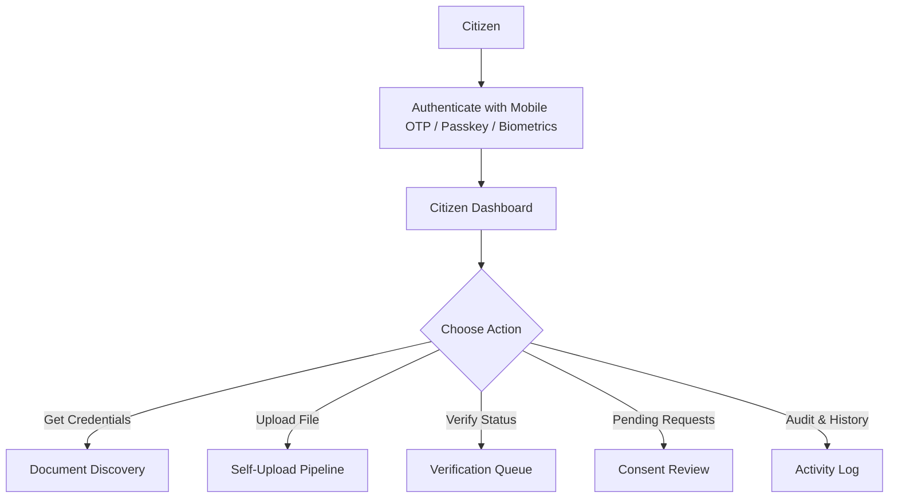
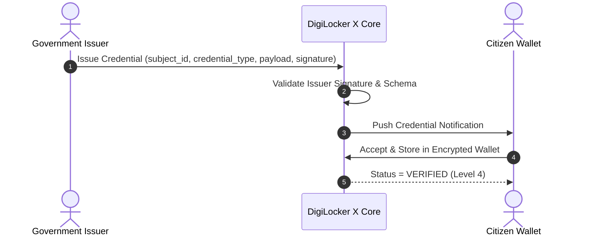
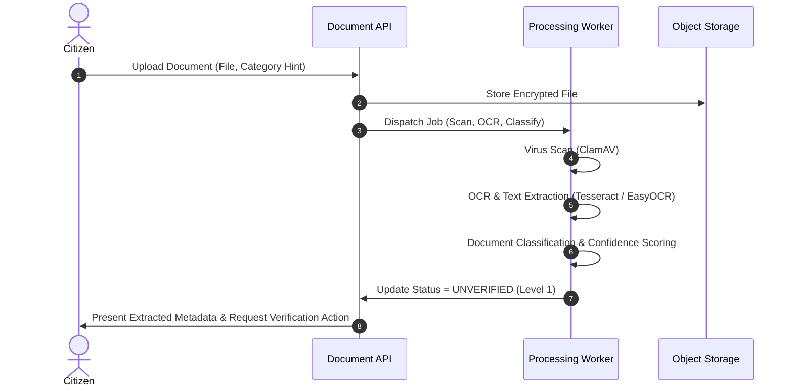
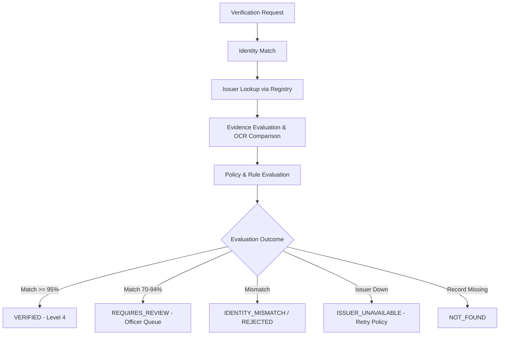
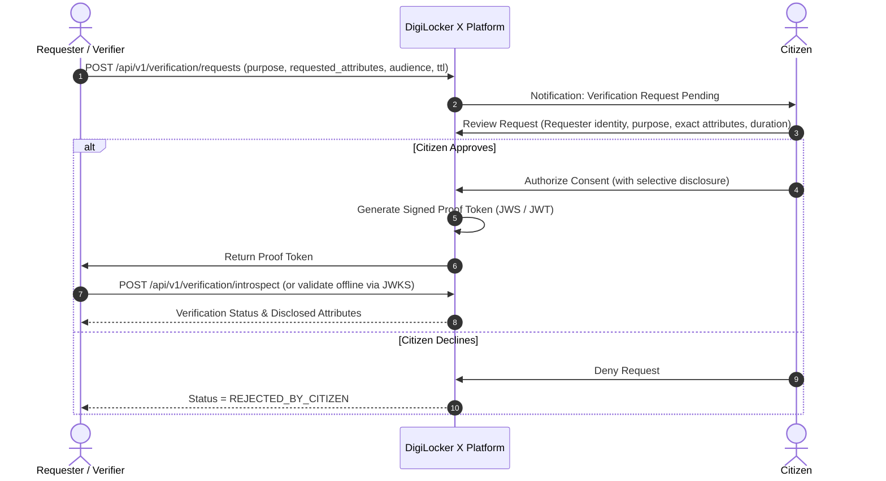

# DigiLocker X — Workflow Specification

## 1. Purpose

DigiLocker X is a citizen-centric credential and verification platform.

The platform separates:

- **Identity**: Who the citizen is (authenticated via mobile OTP, passkeys, or government eKYC).
- **Documents**: Physical or digital files (PDF, image, structured data).
- **Credentials**: Attested assertions of facts issued by authoritative entities.
- **Verification**: The cryptographic or institutional validation of claims.
- **Consent**: The citizen's explicit, revocable authorization to disclose specific attributes.
- **Proof**: A signed, tamper-evident, short-lived assertion generated for a specific audience and purpose.
- **Document sharing**: The direct exchange of files, which is reserved only for scenarios where the underlying document is strictly legally mandated.

> **Guiding Paradigm**: A requester should ask for a **verifiable claim** wherever possible, rather than requesting a copy of the citizen's document.

---

## 2. Actors & Permissions

### Citizen
The sovereign owner of personal data and credentials.
- Authenticate and manage profile
- Discover documents across government departments and educational boards
- Receive and store government-issued credentials
- Upload self-attested documents for digitization and verification
- Request verification from issuers
- Approve or deny incoming verification requests with selective disclosure
- View full chronological audit history of who accessed or verified what
- Request corrections and track government review cases

### Issuer
Government body or authorized institution that is the authoritative source of truth.
- Issues digitally signed credentials directly into the citizen's wallet
- Verifies records against authoritative source databases
- Revokes or updates credentials upon status changes
- Responds to automated or manual verification requests via standardized adapters

### Verifier / Requester
Organization requesting proof of a qualification, entitlement, or attribute.
- *Examples*: Examination authorities, universities, employers, scholarship bodies, government portals
- Creates scoped verification requests specifying purpose, required attributes, and expiration
- Validates signed proof tokens offline or via public JWKS / introspection endpoints
- Never receives raw citizen documents unless explicitly permitted and legally required

### Government Officer
Authorized human reviewer handling edge cases, legacy records, and discrepancy escalations.
- Reviews verification queues and compares uploaded evidence against registry records
- Approves, rejects, or requests clarifications from the citizen
- Escalates fraudulent attempts and issues official corrections to records

### Platform Administrator
Maintains the health, security, and governance of the DigiLocker X ecosystem.
- Onboards and manages issuers and requester organizations
- Manages global verification policies and cryptographic trust anchors
- Monitors audit logs, system health, and feature flags

---

## 3. Core Workflows

### 3.1 Citizen Navigation & Action Selection



### 3.2 Government-Issued Document Issuance

When a government department or educational board issues a credential directly to the citizen:



### 3.3 Self-Upload & Classification Pipeline

When a citizen uploads a legacy or physical certificate:



### 3.4 Verification Engine



### 3.5 Consent-Controlled Sharing Flow

The default platform behavior is **VERIFY** instead of **TRANSFER**.



---

## 4. Cryptographic Proof Specification

A verification proof is a compact, cryptographically signed assertion formatted as a JSON Web Signature (JWS) conforming to RFC 7515 / RFC 7519.

### Proof Structure

```json
{
  "proof_id": "prf_8f9a2b1c4d5e",
  "subject": "subj_demo_5c7b90",
  "credential": {
    "id": "cred_cbse_xii_2026",
    "type": "CLASS_XII_QUALIFICATION",
    "disclosed_attributes": {
      "qualification": "Senior School Certificate Examination (Class XII)",
      "passing_year": 2026,
      "result": "PASS",
      "stream": "Science"
    }
  },
  "issuer": {
    "id": "org_cbse_gov_in",
    "name": "Central Board of Secondary Education",
    "jurisdiction": "National"
  },
  "verification_result": "VERIFIED",
  "verification_level": 4,
  "audience": "aud_national_testing_agency",
  "purpose": "EXAMINATION_APPLICATION",
  "nonce": "nonce_e3b0c44298fc1c14",
  "issued_at": 1787392800,
  "expires_at": 1787393700,
  "signature": "eyJhbGciOiJFZERTQSI...sign..."
}
```

### Invariant Properties of Proofs
1. **Signed**: Digitally signed using DigiLocker X's hardware security module (HSM) or sovereign private key.
2. **Short-Lived**: Default TTL of 10–15 minutes to minimize exposure windows.
3. **Purpose-Bound**: Can only be used for the declared transaction (e.g., `EXAMINATION_APPLICATION`).
4. **Audience-Bound**: Explicitly names the recipient organization; unusable by third parties.
5. **Non-Replayable**: Contains a cryptographically random cryptographic nonce validated during introspection.
