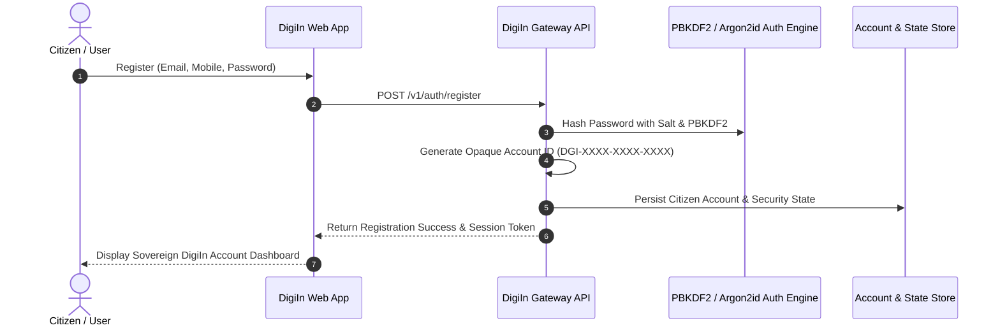
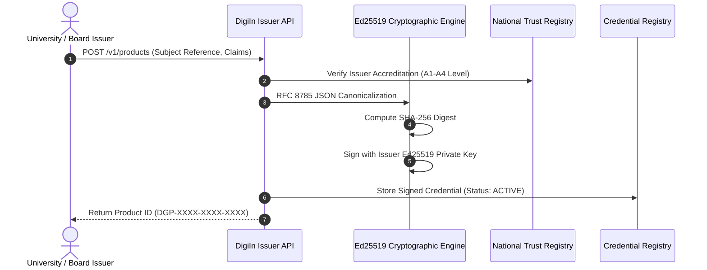
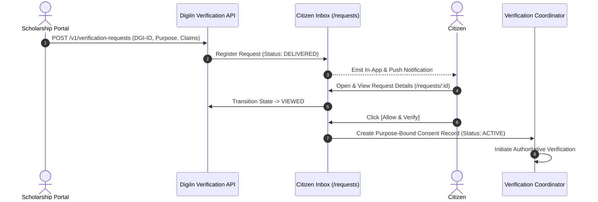
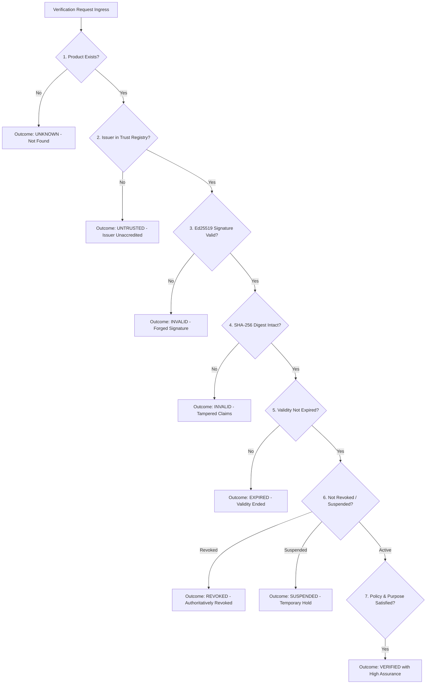
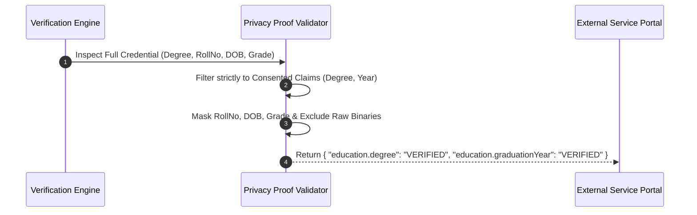
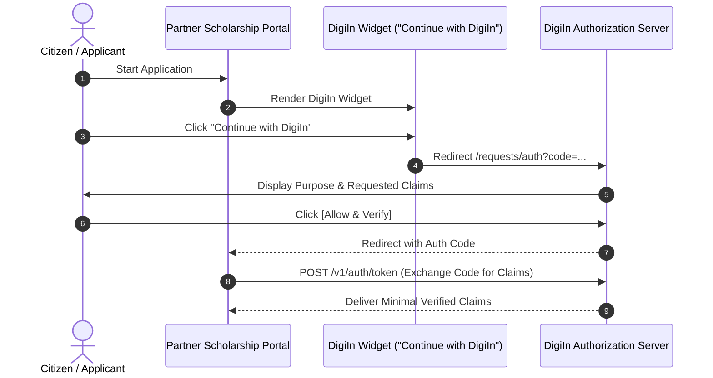
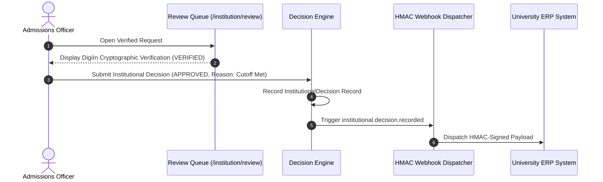
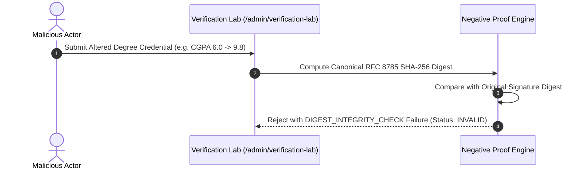

# DigiIn — Comprehensive Operational Flowcharts

This document compiles the 10 core operational sequence and workflow flowcharts across the platform.

---

## 📌 Flow 1: Sovereign Citizen Identity & Account Creation

---

## 📌 Flow 2: Issuer Credential Issuance & Signing

---

## 📌 Flow 3: Institutional Request & Purpose-Bound Citizen Consent

---

## 📌 Flow 4: Product Verification Engine (7-Point Check Matrix)

---

## 📌 Flow 5: Minimal Disclosure & Selective Disclosure

---

## 📌 Flow 6: Embeddable Service Integration Widget Flow

---

## 📌 Flow 7: Departmental Stepper Wizard & Review Queue Decision

---

## 📌 Flow 8: Negative Proof & Tamper Detection Lifecycle

