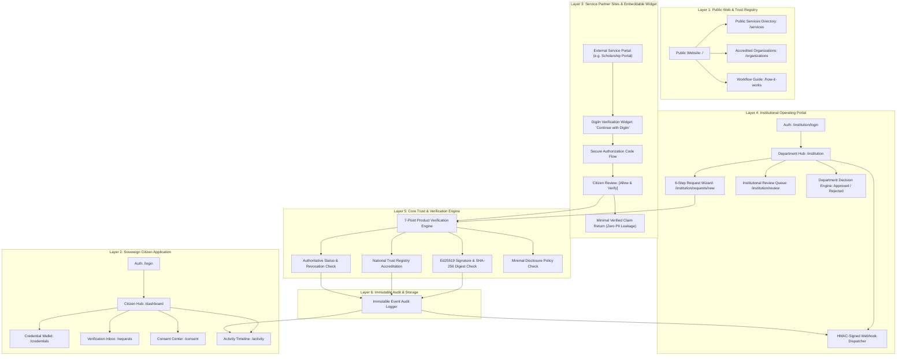

# DigiIn — Master Architecture & Technical Specification

DigiIn is a national-scale, sovereign **Digital Trust and Verification Infrastructure** designed to bridge citizens, authoritative credential issuers, and verifying institutions.

---

## 🏛️ 1. Platform Reference Architecture

---

## 🔒 2. Core Architectural Invariants

1. **Verification Over Storage**: DigiIn is an authoritative verification intermediary, not a static document warehouse. A document in storage is never assumed valid without deterministic verification.
2. **Explicit Citizen Consent**: Services must declare purpose and request specific claims. The citizen reviews the exact fields and grants explicit, time-bounded consent (`[Allow & Verify]`).
3. **Minimal Disclosure**: Services receive only verified Boolean/attribute claims (`education.degree: VERIFIED`), without leaking unrequested PII, roll numbers, DOB, or raw document binaries.
4. **Separation of Duties**: DigiIn determines cryptographic authenticity (`VERIFIED`); the verifying department independently reviews applicant eligibility and records institutional decisions (`APPROVED` / `REJECTED`).
5. **Deterministic Proof & Anti-Tamper**: Any modification to credential payload bytes or signatures mathematically produces `INVALID`.
