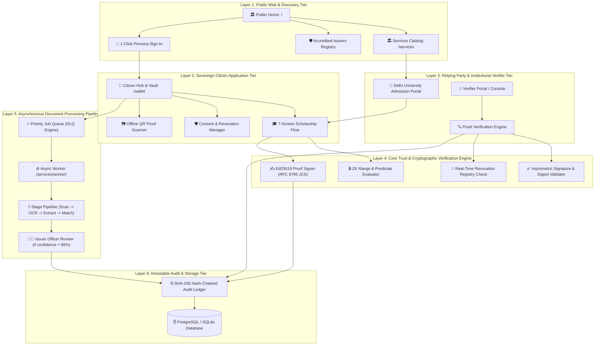
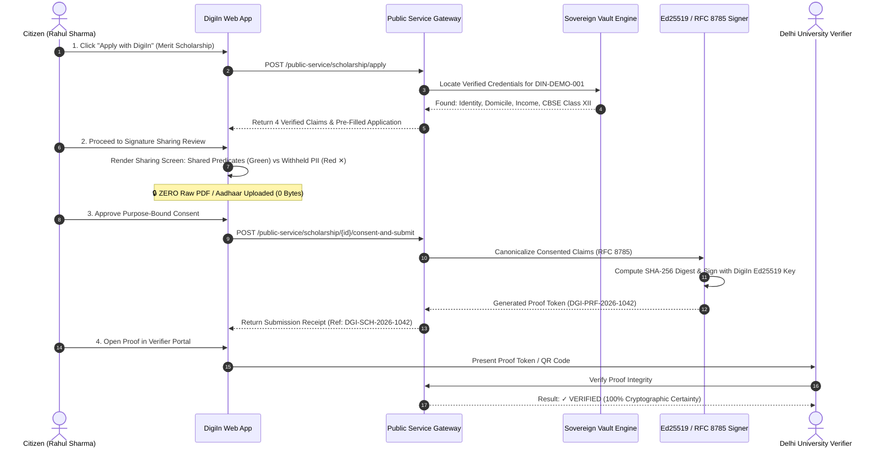
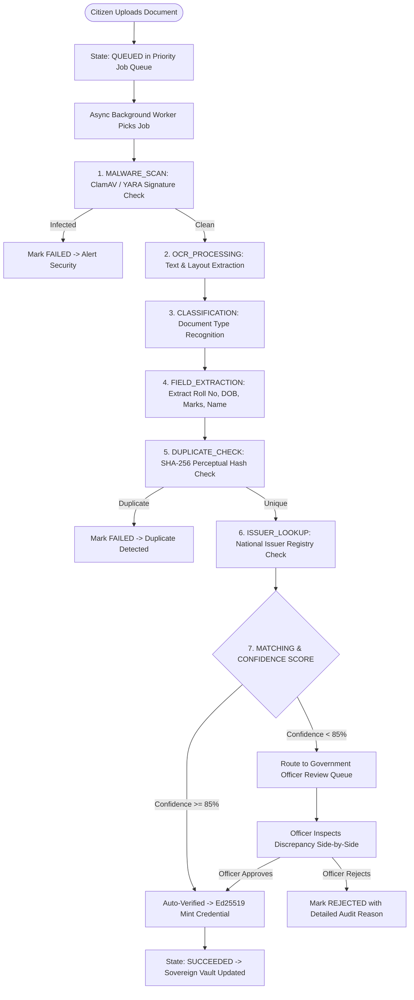
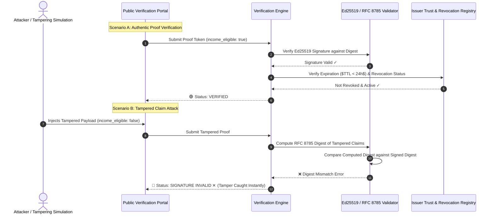
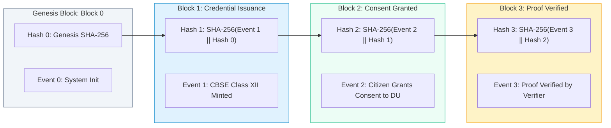

# DigiLocker X (DigiIn) — Master System Flowcharts & Visual Architecture

## 1. Overall Platform Topology & Layer Interactions



---

## 2. Flowchart 1: Flagship Zero-Upload Scholarship Journey (7-Screen Sequence)



---

## 3. Flowchart 2: Asynchronous Document Processing Pipeline & Human Fallback



---

## 4. Flowchart 3: Cryptographic Proof Minting & Negative Proof Defense (Tamper Attack)



---

## 5. Flowchart 4: Attribute-Based Access Control (ABAC) & Zero-Knowledge Predicate Engine

```mermaid
flowchart TD
    Request([Incoming Data Access Request]) --> ExtractContext[Extract Subject, Resource, Action & Environment]
    
    ExtractContext --> CheckPolicy{ABAC Policy Engine Evaluation}
    CheckPolicy -- Violates Role / Time / Purpose --> DenyAccess[🚫 403 Forbidden: Policy Violation]
    
    CheckPolicy -- Policy Passed --> CheckDisclosureType{Is Disclosure Full or ZK Predicate?}
    
    CheckDisclosureType -- ZK Range Predicate --> ZkEval[Evaluate Predicate: income < 250000 -> Boolean]
    ZkEval --> MaskValue[Mask Exact Salary Amount -> Return 'income_eligible: true']
    
    CheckDisclosureType -- Minimal Field --> StripPii[Strip Non-Consented Fields (Aadhaar, Phone, Raw Scans)]
    
    MaskValue --> SignPayload[Ed25519 Sign Minimal Payload]
    StripPii --> SignPayload
    
    SignPayload --> Output([Return Zero-PII Cryptographic Assertion])
```

---

## 6. Flowchart 5: Immutable Hash-Chained Audit Ledger ($H(E_n \parallel H_{n-1})$)



---

## 7. Flowchart 6: Cloud Deployment Topology & Render Sandbox Architecture

```mermaid
flowchart TD
    Internet([Public Internet / Hackathon Jury]) --> CloudDNS["Public HTTPS URL: https://digiin-web.onrender.com"]
    
    subgraph RenderPlatform[Render Cloud Infrastructure]
        CloudDNS --> WebService["digiin-web (Vite / React Static SPA)"]
        
        WebService -- "/api/v1/* (VITE_API_BASE_URL)" --> ApiService["digiin-api (FastAPI / Python 3.12)"]
        
        ApiService --> WorkerService["digiin-worker (Background Job Worker)"]
        
        ApiService -- "DIGIIN_DATABASE_URL" --> PostgresDB[("digiin-db (PostgreSQL)") ]
        WorkerService -- "DIGIIN_DATABASE_URL" --> PostgresDB
        
        subgraph SandboxLayer[Deterministic Sandbox Mock Layer]
            ApiService --> MockAuth["Demo Auth (1-Click Personas)"]
            ApiService --> MockKYC["Demo KYC (KYC-DEMO-001)"]
            ApiService --> MockGov["Demo Registries (CBSE, Revenue, Transport)"]
            ApiService --> MockNotif["Demo Notifications (In-App)"]
        end
    end
```
